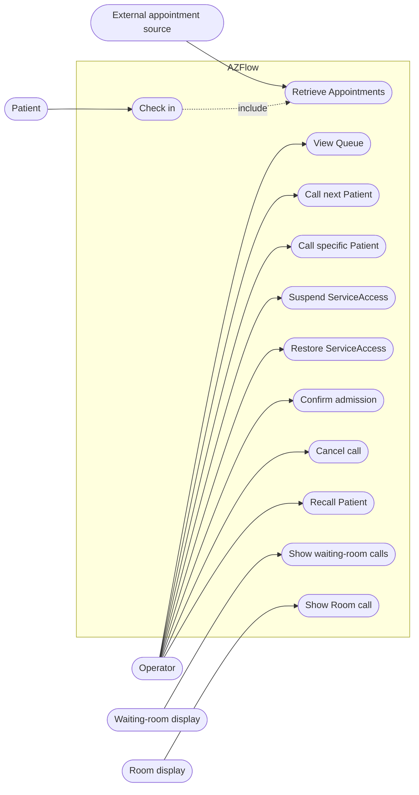

# Requirements

This chapter consolidates the requirements of the implemented AZFlow scope. During development, requirements were refined incrementally in feature specifications. The report presents the resulting system-level requirements rather than reproducing each development specification.

## User stories

The main user stories are:

- **Patient:** As a Patient, I want to check in for my scheduled services and receive a public call code, so that I can enter the operational flow without my identity being shown publicly.
- **Operator:** As an Operator, I want to view and process the ServiceAccesses of a Queue, so that I can manage Patients according to the operational policy and their current state.
- **Operator:** As an Operator, I want to call a Patient to a selected Room, so that the Patient knows where to go.
- **Operator:** As an Operator, I want to suspend, restore, admit, cancel a call or recall a Patient when needed, so that the software follows the real operational workflow.
- **Waiting Patient:** As a waiting Patient, I want public displays to show recent calls relevant to my location, so that I can recognize my public call code and destination Room.
- **Room Patient:** As a Patient near a Room, I want its display to show the current call, so that I can verify that I am entering the correct Room.
- **System integrator:** As a system integrator, I want external appointment systems to be accessed through a defined boundary, so that AZFlow does not depend on one specific external system.

## Use cases

The following diagram summarizes the main interactions between AZFlow and its external actors. It intentionally stays at requirements level and does not show implementation components.

## Glossary

| Term | Meaning |
| --- | --- |
| **Patient Identifier** | Typed identifier presented at check-in. The implemented demonstrator supports the Italian fiscal code. |
| **Operational day** | Calendar day used to group AZFlow daily operational state. |
| **Appointment** | Scheduling information imported from an external source. It does not contain AZFlow operational state. |
| **Agenda** | Healthcare schedule associated with Appointments and used to connect ServiceAccesses to Queues. |
| **DailyPresence** | Operational context created for one Patient Identifier during one operational day. It does not represent physical presence at a specific location. |
| **ServiceAccess** | Operational access to one healthcare service. Its state represents the progress of that access through AZFlow. |
| **Queue** | Operational view over ServiceAccesses belonging to its associated Agendas. A Queue does not own or duplicate ServiceAccesses. |
| **QueuePolicy** | Rule used to order eligible ServiceAccesses. The implemented policies are BY_ARRIVAL and BY_APPOINTMENT. |
| **TicketMaster** | Namespace used to allocate public call codes. |
| **Public call code** | Non-identifying code, for example AAA001, used to call a Patient publicly. |
| **Room** | Configured destination used when a ServiceAccess is called. |
| **LocationNode** | Node of the hierarchical physical topology used to scope Rooms, Totems and waiting-room monitors. |
| **Totem** | Check-in point optionally recorded as the origin of a DailyPresence. |
| **WaitingRoomMonitor** | Public display configuration scoped to one or more LocationNodes. |
| **RoomMonitor** | Public display associated with one Room. |

## Functional requirements

### FR1 - Patient check-in

AZFlow shall allow a Patient to check in using a supported Patient Identifier and shall retrieve the relevant Appointments for the current operational day.

**Acceptance criteria**

- A valid identifier with at least one relevant Appointment produces a successful check-in.
- An unknown or unsupported identifier produces a client error and does not create operational state.
- Only Appointments connected to operationally configured services are considered.
- A check-in may record the Totem from which it originated when that information is supplied.

### FR2 - Daily presence and public call code

AZFlow shall create one DailyPresence for a Patient Identifier in an operational day and assign one public call code to it.

**Acceptance criteria**

- Repeating the same check-in on the same operational day reuses the existing DailyPresence and public call code.
- The public call code remains unchanged during the operational day.
- All ServiceAccesses belonging to the same DailyPresence use the same public call code.
- Public call-code allocation remains unique for the relevant TicketMaster and operational day.

### FR3 - ServiceAccess creation

AZFlow shall create the ServiceAccesses required by the relevant Appointments without creating duplicates.

**Acceptance criteria**

- Each relevant recognized Appointment creates at most one ServiceAccess in the same DailyPresence.
- A new ServiceAccess starts in WAITING state.
- A Patient with multiple relevant Appointments may receive multiple ServiceAccesses while keeping one DailyPresence and one public call code.
- Repeated check-in does not duplicate existing ServiceAccesses.

### FR4 - Queue view and ordering

AZFlow shall allow an Operator to view the ServiceAccesses relevant to an active Queue for the current operational day.

**Acceptance criteria**

- The Queue view contains ServiceAccesses belonging to the Agendas served by the selected Queue.
- A ServiceAccess can be visible through more than one Queue without being copied.
- BY_APPOINTMENT orders eligible accesses by scheduled appointment time with deterministic tie-breaking.
- BY_ARRIVAL orders eligible accesses by check-in time with deterministic tie-breaking.
- An inactive or unknown Queue cannot be used as an active operational Queue.

### FR5 - Patient calling

AZFlow shall allow an Operator to call either the next eligible ServiceAccess according to Queue policy or a specific callable ServiceAccess.

**Acceptance criteria**

- A successful call changes the ServiceAccess to CALLED.
- Every call requires a configured Room.
- The Room selected at call time is persisted with the ServiceAccess.
- Calling through one Queue changes the same ServiceAccess visible through any other Queue.
- Two concurrent operations cannot successfully call the same ServiceAccess.

### FR6 - ServiceAccess state management

AZFlow shall support the operational state transitions required after check-in.

**Acceptance criteria**

- A WAITING ServiceAccess can be suspended.
- A SUSPENDED ServiceAccess can be restored to WAITING or called directly.
- A CALLED ServiceAccess can be admitted or its call can be cancelled.
- Cancelling a call returns the ServiceAccess to WAITING.
- An ADMITTED ServiceAccess can be recalled to the same Room used for its call.
- Invalid or conflicting state transitions are rejected.

### FR7 - Transition history

AZFlow shall preserve the successful state-transition history of each ServiceAccess.

**Acceptance criteria**

- Each successful transition records the previous state, resulting state and occurrence time.
- Existing history is not overwritten when a new transition occurs.
- Persisted history can be used to reconstruct display state after a client reconnects.
- The first call time remains available independently from later admission or recall operations.

### FR8 - Location and display scope

AZFlow shall represent a hierarchical location topology and use it to determine which public displays are relevant to a Room call.

**Acceptance criteria**

- Location nodes can form a hierarchy without requiring fixed levels such as building, floor or department.
- Rooms belong to configured LocationNodes.
- A WaitingRoomMonitor receives calls for Rooms contained in its configured topology scope.
- A RoomMonitor receives calls only for its associated Room.

### FR9 - Public call displays

AZFlow shall provide current and recent call information to public displays.

**Acceptance criteria**

- A WaitingRoomMonitor can obtain a bounded list of recent calls in its scope for the operational day.
- A RoomMonitor can obtain the current call for its Room.
- A newly connected display receives an initial snapshot of the current persisted display state.
- Relevant successful calls are delivered to connected displays without requiring them to poll continuously.
- Cancelling, admitting or recalling a ServiceAccess updates the visible display state consistently with its current operational state.

### FR10 - Operator operational view

AZFlow shall provide the Operator with the information and actions required to manage the complete operational-day workflow.

**Acceptance criteria**

- The Operator can discover available Rooms and Queues.
- The operational list includes WAITING, SUSPENDED, CALLED and ADMITTED ServiceAccesses relevant to the selected Queue.
- The list exposes check-in time and appointment time when applicable.
- Available actions depend on the current ServiceAccess state.
- Appointment timing after a call is based on the persisted first-call time and is not reset by a later recall.

### FR11 - External appointment-source boundary

AZFlow shall obtain appointment information through an external-source boundary rather than requiring appointment data to be owned by AZFlow.

**Acceptance criteria**

- Check-in can query a configured appointment source using the Patient Identifier.
- External scheduling information remains distinct from AZFlow operational state.
- Source-specific patient and appointment references do not become AZFlow patient identities.
- The implemented workflow can operate with a mock appointment source without changing the application behaviour.

## Non-functional requirements

### NFR1 - Privacy

Patient-identifying information shall not be exposed by public call displays or by operational responses where the public call code is sufficient.

**Acceptance criteria**

- Waiting-room and Room display data never contains the Patient Identifier.
- Public calls identify a Patient through the public call code.
- Operator queue/call responses used by the implemented workflow do not expose the Patient Identifier.

### NFR2 - Consistency under concurrency

Operations that allocate unique public codes or perform competing ServiceAccess transitions shall preserve a consistent result under concurrent requests.

**Acceptance criteria**

- The same daily public sequence number cannot be successfully allocated twice within one TicketMaster.
- Concurrent call operations cannot both successfully transition the same ServiceAccess.
- Concurrent conflicting state transitions cannot both be accepted when their preconditions are no longer valid.

### NFR3 - Recoverable display state

Transient real-time delivery shall not be the only source of display state.

**Acceptance criteria**

- A display that was disconnected can obtain the correct current state after reconnecting.
- Current display state can be reconstructed from persisted operational information and transition history.

### NFR4 - Verifiability

The main domain and application behaviours shall be automatically verifiable independently from the user interfaces.

**Acceptance criteria**

- Automated tests cover domain/application behaviour and API behaviour.
- Persistence integration tests run against a disposable database.
- The project maintains the course target of at least 70% global line coverage.
- Static checks and automated tests must pass before a release is produced.

## Implementation constraints

The project started from the Python project template supplied for the Software Engineering course. Therefore, the template development and release infrastructure is retained as a project constraint rather than introduced as a domain requirement.

### IC1 - Course project toolchain

The project shall preserve the course-provided automated quality and release workflow unless a project requirement makes a change necessary.

**Justification:** this keeps the project compatible with the course delivery environment and its expected automated checks.

**Acceptance criteria**

- The repository remains buildable and testable through the provided Python/Poetry project structure.
- Automated formatting, linting, static type checking, testing and coverage checks remain available.
- The GitHub Actions and semantic-release based delivery workflow remains operational.

Technology choices made to implement the requirements, including FastAPI, PostgreSQL, WebSockets and Alembic, are discussed in the Design and Development chapters rather than treated as requirements.
