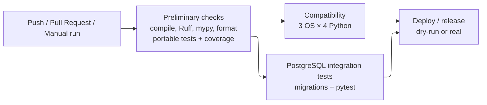

# CI/CD

AZFlow uses GitHub Actions to automate verification and release delivery. The pipeline is designed as a sequence of increasingly expensive checks: fast quality checks run first, portable tests then exercise the supported Python/operating-system combinations, PostgreSQL integration tests verify the real persistence boundary, and only after all verification stages succeed can the release workflow run.

The main workflow is defined in `.github/workflows/check.yml`; release delivery is isolated in the reusable `.github/workflows/deploy.yml` workflow. The same Poe tasks used by developers locally are called from CI where possible, reducing differences between local and automated verification.

## Workflow triggers

The CI/CD workflow runs on normal repository pushes, pull requests and manual `workflow_dispatch` executions. Pushes from Dependabot and Renovate branches are excluded, and changes limited to a small set of repository metadata/documentation files are ignored for push-triggered runs.

Both `development` and `master` therefore receive the same verification pipeline when code changes are pushed. The difference appears only in the final release stage: on branches other than `master`/`main`, `semantic-release` runs in dry-run mode, while a successful run on the releasable branch can publish a new version. This lets the release configuration be exercised during development without creating packages or tags.

Conceptually, the pipeline is:



## Preliminary quality gate

The `check` job runs first on Ubuntu and restores the Poetry development environment. It performs four kinds of verification:

| Check | Command | Purpose |
| --- | --- | --- |
| Syntax compilation | `poetry run poe compile` | Detect invalid Python source before later jobs. |
| Static checks | `poetry run poe static-checks` | Run Ruff linting and mypy type checking. |
| Formatting | `poetry run poe format-check` | Ensure committed Python files follow the project formatter. |
| Tests and coverage | `poetry run poe coverage` plus reports | Run the portable pytest suite and collect line coverage. |

Coverage is produced both as console output and as an HTML report. The `htmlcov` directory is uploaded as a GitHub Actions artefact named with the commit SHA, making the detailed report inspectable after a CI execution.

This first test execution intentionally uses the portable suite. Tests requiring `AZFLOW_TEST_DATABASE_URL` are skipped when no dedicated test database is configured; PostgreSQL behaviour is verified separately by the integration job described below.

## Compatibility matrix

After the preliminary checks pass, the `test` job executes the portable test suite across a matrix of:

- Ubuntu, Windows and macOS;
- Python 3.10, 3.11, 3.12 and 3.13.

This creates **12 independent compatibility runs**. `fail-fast` is disabled, so one failing combination does not prevent the remaining combinations from completing; this makes compatibility failures easier to diagnose. Each job has a 45-minute timeout.

The matrix provides evidence that the Python application and its non-database behaviour are not accidentally tied to one developer workstation or operating system. The package metadata currently accepts Python `>=3.10,<4.0`, but the automated compatibility evidence is specifically limited to the versions in this matrix; newer Python 3.x versions are not claimed as CI-verified until they are added to it.

## PostgreSQL integration

The `integration-test` job runs in parallel with the compatibility matrix after the preliminary gate. GitHub Actions starts a PostgreSQL 16 service container with a dedicated `azflow_test` database and waits for it to become healthy.

The job exposes the PostgreSQL connection settings and `AZFLOW_TEST_DATABASE_URL` only inside the CI environment. It then restores the project, applies the complete Alembic migration chain with:

```bash
poetry run poe db-upgrade
```

and runs pytest. With the database URL available, the PostgreSQL persistence and cross-layer integration tests are included instead of skipped. This stage therefore checks both that a fresh database can be migrated to the current schema and that the real Psycopg adapters work against it.

The credentials used for this disposable PostgreSQL service are test-only values defined directly in the workflow. They are not production secrets.

## Delivery and release automation

The final `deploy` job depends on both the compatibility matrix and PostgreSQL integration job. Because those jobs themselves depend on the preliminary checks, release delivery is reachable only after all verification stages have succeeded.

The job calls the reusable `deploy.yml` workflow. That workflow retrieves the complete Git history and tags, restores Poetry and the Node release tooling, and executes `semantic-release`. Release jobs share the `deploy` concurrency group, so two release processes cannot publish concurrently.

The following credentials and configuration values are relevant to delivery:

| Value | Source | Use |
| --- | --- | --- |
| `PYPI_TOKEN` | GitHub repository secret | Authentication when publishing the AZFlow package to TestPyPI. |
| `GITHUB_TOKEN` | Automatically provided by GitHub Actions | Create/update release-related GitHub content with the workflow's `contents: write` permission. |
| `RELEASE_TEST_PYPI=true` | Workflow environment | Select the configured TestPyPI repository rather than production PyPI. |
| `RELEASE_DRY_RUN` | Computed by the workflow | Prevent publication when the run is not on `master`/`main` or when release execution must be simulated. |

Secret values are never stored in the repository. The TestPyPI repository endpoint itself is non-secret and is defined in the project Poetry configuration.

`semantic-release` analyses the Conventional-Commit-style history and decides whether a new version is needed. On a real release it delegates version update/build/publication to Poetry, creates the Git tag and GitHub Release, attaches the generated distributions, updates the changelog and commits the resulting release metadata. The detailed SemVer rules and published artefacts are described in the Release chapter.

## Continuous delivery boundary

The project implements **continuous delivery of the software package**, not automatic deployment into a running hospital environment. A successful `master` pipeline can publish a versioned package to TestPyPI and a corresponding GitHub Release, but installation on an application server, database migration and service rollout remain explicit deployment operations.

This boundary is deliberate for the current project: the target clinical infrastructure is not part of the university repository, and the implemented slice still uses a mock appointment source and does not include the production identity/integration components described as future work.

## Possible evolution: container delivery

A natural evolution of the current delivery model would be to publish AZFlow also as a versioned container image. The repository already contains a `Dockerfile`, so the CI/CD pipeline could build the image only after the existing quality, compatibility and PostgreSQL integration gates have passed, then push it to a container registry such as GitHub Container Registry.

The container image would become an additional release artefact alongside the Python package rather than replacing it. Each image should use the same semantic version as the corresponding AZFlow release, for example `v2.0.0`, so that the package, Git tag, GitHub Release and container image remain aligned. A mutable convenience tag such as `latest` could optionally point to the most recent stable image, while deployment automation should prefer immutable version tags.

This approach would simplify server-side delivery because Python and application dependencies would be packaged into the image, leaving PostgreSQL, secrets, migrations and runtime configuration as deployment concerns. It would also provide a clearer path toward later deployment through Docker Compose, Kubernetes or another container orchestration platform without changing the internal AZFlow architecture.

For the current university project this remains a possible evolution: no container image is published and the authoritative release artefact is still the Python package on TestPyPI.
