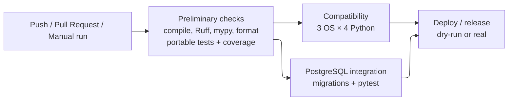

# CI/CD

GitHub Actions automates verification and release delivery. Fast quality checks run first; compatibility and PostgreSQL integration then run in parallel; release is possible only after both succeed.

The main workflow is `.github/workflows/check.yml`; release logic is in reusable `.github/workflows/deploy.yml`. CI reuses the same Poe tasks available locally.

## Workflow and triggers

The workflow runs on pushes, pull requests and manual `workflow_dispatch` runs. `development` and `master` receive the same verification path; only the final release stage differs. Outside `master`/`main`, semantic-release runs in dry-run mode.



## Preliminary quality gate

The first Ubuntu job performs:

| Check | Command |
| --- | --- |
| Syntax | `poetry run poe compile` |
| Lint/type checking | `poetry run poe static-checks` |
| Formatting | `poetry run poe format-check` |
| Tests/coverage | `poetry run poe coverage` |

The HTML coverage report is uploaded as a workflow artefact. This stage uses the portable suite; PostgreSQL tests are handled separately.

## Compatibility matrix

The portable suite runs on Ubuntu, Windows and macOS with Python 3.10, 3.11, 3.12 and 3.13: **12 combinations**. `fail-fast` is disabled so all combinations complete even if one fails.

Package metadata accepts Python `>=3.10,<4.0`, but CI evidence is limited to 3.10–3.13 until newer versions are added to the matrix.

## PostgreSQL integration

After the preliminary gate, an integration job starts PostgreSQL 16 with a dedicated `azflow_test` database, applies all migrations with:

```bash
poetry run poe db-upgrade
```

and runs pytest with `AZFLOW_TEST_DATABASE_URL` set. This verifies both migration from an empty database and the real Psycopg adapters. The database credentials are disposable CI-only values.

## Delivery and release

The final deploy job depends on both compatibility and integration results. `deploy.yml` restores the full Git history/tags, installs Poetry and Node release tooling, and runs semantic-release. A concurrency group prevents two release jobs from publishing at the same time.

| Value | Source | Use |
| --- | --- | --- |
| `PYPI_TOKEN` | Repository secret | TestPyPI publication |
| `GITHUB_TOKEN` | GitHub Actions | Tags and release metadata |
| `RELEASE_TEST_PYPI=true` | Workflow environment | Select TestPyPI |
| `RELEASE_DRY_RUN` | Workflow-computed | Disable publication outside releasable runs |

Semantic-release decides the version from commit history, delegates build/publication to Poetry, creates the tag and GitHub Release and updates release metadata. Detailed version rules are described in the Release chapter.

## Delivery boundary and possible evolution

The pipeline provides **continuous delivery of the package**, not automatic deployment to hospital infrastructure. Installation, migrations and service rollout remain explicit operations.

A future extension could also publish the existing `Dockerfile` as a versioned container image after the same quality gates. The image could share the application SemVer and provide a simpler server delivery path, while PostgreSQL, secrets, migrations and runtime configuration would remain deployment concerns. No container image is published today.
